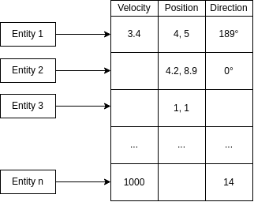

# Entity
The concept of Entity in an ECS is very different from a classical Entity class that can be found in other Game Engines, but it is very simple to understand.

An Entity is just a number, that correspond to a position in the differents arrays of [Components](Component.md) stored in the [Registry](Registry.md).

Here is a schema explaining how we retrieve values from the Entity index:



The class Entity looks like this:

```cpp
class Entity {
    public:
        explicit Entity(size_t size) {};
        operator size_t() const {
            return _size;
        };
    protected:
    private:
        size_t _size;
};
```


## Constructor
### Entity()
```cpp
explicit Entity(size_t size) {}
```
This constructors allows the Entity class to be constructed from a size_t value like this:
Entity e = 13;


## Operator
### size_t()

```cpp
operator size_t() const
```
Returns the `size_t` value of the Entity

## Value
### size_t _size

```cpp
size_t _size
```
The "index" of the Entity in the [Registry](Registry.md)