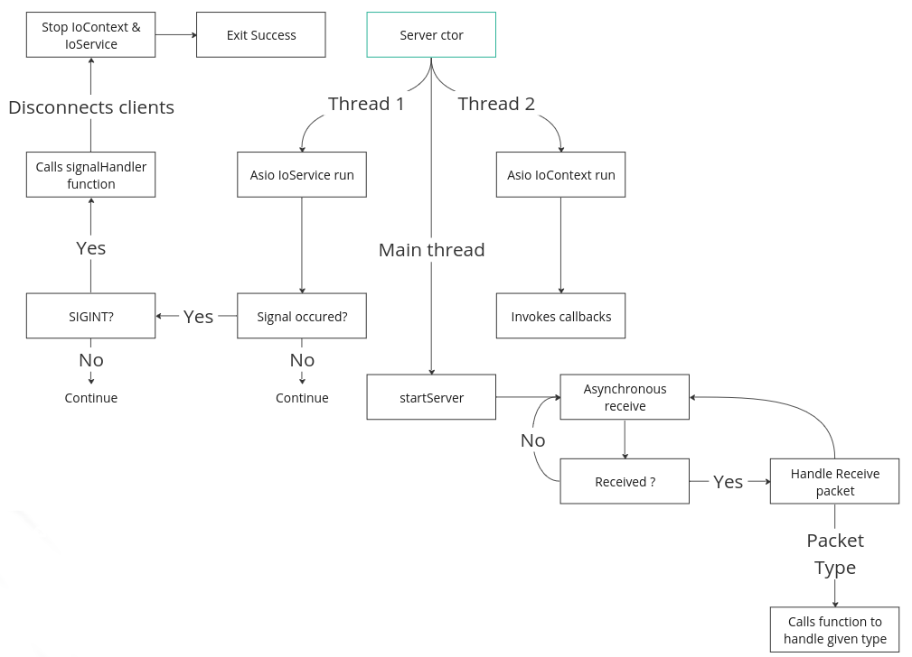

# Architecture
The server should be self-explanatory when reading the source code, nevertheless, this documentation provides more details about the server workflow.

The server uses Asio non-boost C++20 to run.

The network code can be found under the `rtype` namespace included in the `Game.hpp`.

To instantiate a new server, simply call the `Server` class constructor and calls `startServer()` to start the server.
Just by doing that will run your server properly. However, you need to keep your program open or the server will close itself if the main returns.



Here is an example of implementation
```cpp
#include "Game.hpp"

int main()
{
    rtype::loopSystem game;
    game.runNetwork();

    while (true) {
        // Game logics
    }
}
```

## CFG Config files
The configuration file is required to run the server with modified settings.
It provides the host and port to listen to.

Here is the `server.cfg` file located inside the `resources` directory.
```conf
# Server config file

# IP Address to connect to
host=127.0.0.1

# Port of the host to connect to
port=12346
```


## Constructors/Destructors
### Server default ctor
`Network()`

Network class ctor.
The ctor will seek a `.cfg` file for its configuration as mention before. If the file format is corrupted, a value can't be found or the file is missing, the default values are applied.
If unchanged in the code, they will be 127.0.0.1 for the host and 12346 for the port number

### ~Server
`~Server()`

The `Server` class destructor.


## Getters
### getIoContext
`asio::io_context &getIoContext() const noexcept`

Returns the Asio IO context.

### getIoService
`asio::io_context &getIoService() const noexcept`

Returns the Asio IO Serivice.

### getHost
`const std::string &getHost() const noexcept`

Returns the Host string.

### getPort()
`std::uint16_t getPort() const noexcept`

Returns the Port number as an unsigned 16bits integer

### getServerEndpoint
`const asio::ip::udp::endpoint &getServerEndpoint() const noexcept`

Returns the server endpoint, the endpoint corresponds to the communication terminaison of the server.

### getSocket
`const asio::ip::udp::socket &getSocket() const noexcept`

Returns the server socket.

### getAsioErrorCode
`const asio::error_code &getAsioErrorCode() const noexcept`

Returns the Asio error code. This value is set whenever an error occures in the Asio context.

### getClients
`std::vector<Client> &getClients() const noexcept`

Returns the connected clients as a vector of Client class.

### getPacket
`const std::array<std::uint8_t, packetSize> &getClients() const noexcept`

Returns the last packet received.

## Setters
### setHost
`void setHost(const std::string &host)`

Sets the server host.

### setPort
`void setPort(std::uint16_t port)`

Sets the server port

### setConnection
`void setConnection(const std::string &host, std::uint16_t port)`

Sets the server host and port, This calls to the `setHost` and `setPort`.

### setServerInstance
`static void setServerInstance(Server* instance)`

Set the static variable `serverInstance` used to access class elements from the IO Service, mainly used to handle CTRL-C event.

### setPacket
`void setPacket(T &packet, packet::packetHeader &header, T &data)`

Sets the packet from a `typename T` template packet, the packet header and its data.
This function will memory copy the `header` and `data` into the `packet`. The packet must be large enough to hold the header + data sizes.

## Miscellaneous
### writeToLogs
`void writeToLogs(const std::string_view &status, const std::string &msg)`

Allows to write into the server log a custom message.
The Logs.hpp file provided the following definitions for the `status`:
- logInfo
- logWarn
- logErr
- logGameInfo
- logGameWarn
- logGameErr

### isSocketOpen
`bool isSocketOpen() const noexcept`

Returns true if the socket is open, false otherwise.

### setPacket
`void setPacket(T &packet, packet::packetHeader &header, T &data)`

Memory moves the header and data into the packet, overwriting the potential existing data in the packet T.

### fillBufferFromRequest
`void fillBufferFromRequest(T &packet, std::size_t size)`

Fills the `packet` given as parameter from the private variable `_packet` of the `Server` class.
This function will memory copy into `packet`.

### sendResponse
`void sendResponse(const packet::packetTypes &type, T &data, std::uint64_t roomId = std::numeric_limits<std::uint64_t>::max(), bool toServerEndpoint = false, const std::string cliUuid = "")`

Builds a packet and sends it to all the clients in the given romm identifier if no `cliUuid` are provided.
The `packet` must not contains any header as it is generated using the `type` variable and the size of packet.
If the `cliUuid` is set, the packet will only be sent to the given client UUID. If the UUID is invalid or doesn't link to a valid client, the packet remains unsent.

### sendSparseArray
`void sendSparseArray(const packet::packetTypes &type, sparse_array<T> &sparseArray, std::uint64_t roomId, const std::string cliUuid = "")`

Sends the given ECS sparse array type T to the clients in the room identifier or to a specific client is cliUuid is set.

### receiveCallback
`void receiveCallback(const asio::error_code &errCode, std::size_t bytesReceived)`

Handles the received packet type. This function is called from the asynchronous receiver function from Asio `socket.async_receive_from`.

### receive
`void receive()`

Start the asynchronous receive operations.

### startServer
`void startServer()`

Start the server and calls everything required.

### stopServer
`void stopServer()`

Stop the server properly.

### signalHandler
`static void signalHandler(int signum)`

Handles the signal events.

### addClient
`std::string addClient(std::uint64_t roomId)`

Adds a new client to the client list in the given room identifier and returns its new UUID.

### removeClient
`void removeClient(const std::string &uuid)`

Remove a client from the list given the uuid. If the client is not found, the client list remains unmodified.
